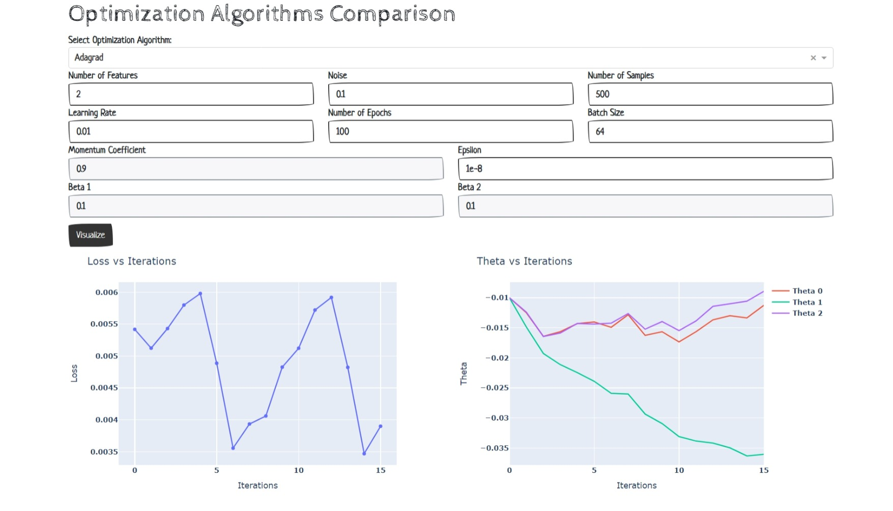

# Optimization Algorithms Comparison

This project aims to compare different optimization algorithms commonly used in machine learning and optimization tasks. The implemented algorithms include:

- Gradient Descent
- Momentum Gradient Descent
- Nesterov Accelerated Gradient (NAG)
- Adagrad
- RMSProp
- Adam

## Deployment

The web application based on this project is deployed and accessible at [Optimization Algorithms Comparison](https://numerical-optimization.onrender.com/).

## Installation

To run this project, follow these steps:

1. Clone this repository to your local machine.
2. Install the required dependencies using `pip install -r requirements.txt`.
3. Run the `app.py` script.

## Usage

Once the application is running, you can use the dropdown menu to select the optimization algorithm you want to compare. You can also adjust various hyperparameters such as learning rate, momentum coefficient, epsilon, beta values, number of features, noise, number of samples, batch size, and number of epochs.

After configuring the parameters, click the "Visualize" button to generate graphs comparing the loss function and thetas (model parameters) across iterations for the selected optimization algorithm.

## Available Algorithms

### Gradient Descent

Standard gradient descent optimization algorithm.

### Momentum Gradient Descent

Gradient descent with momentum to accelerate convergence.

### Nesterov Accelerated Gradient (NAG)

A variant of gradient descent with momentum, which incorporates the momentum term differently.

### Adagrad

Adaptive gradient algorithm that adapts the learning rate for each parameter based on historical gradients.

### RMSProp

Root Mean Square Propagation, an adaptive learning rate method that divides the learning rate by a running average of the magnitudes of recent gradients.

### Adam

Adaptive Moment Estimation, a popular optimization algorithm that combines the ideas of momentum and RMSProp.
